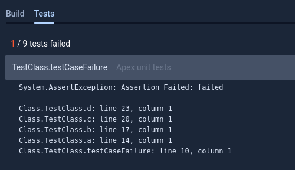
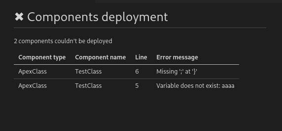
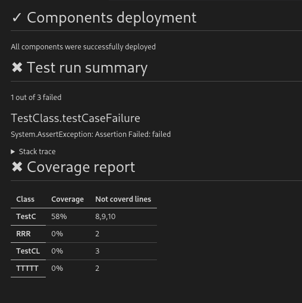
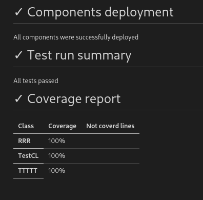
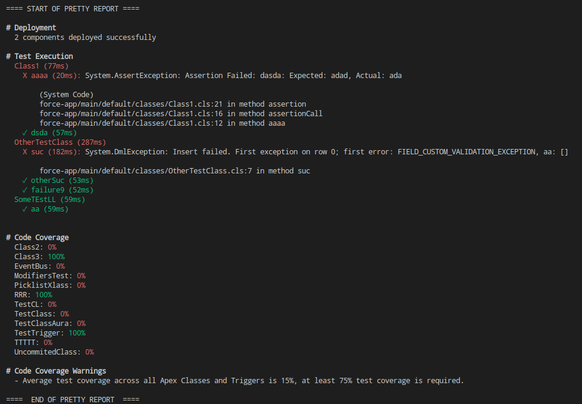

# Deployment summary creator

Generate deployment summaries

## Summary types

### JUnit deployment report

Creates xml file in JUnit format summarizing deployment of components and apex unit tests results. Useful in bitbucket
pipelines for summarizing deployment without need for token generation

### Markdown deployment report

Creates deployment report in Markdown format. Good for automations in GitHub as you can set output file
as [now you can use markdown reports for step summaries](https://github.blog/2022-05-09-supercharging-github-actions-with-job-summaries/)
.

### Coveralls Coverage report

Coveralls report will also be generated.
Its important to bear in mind, that it won't be exactly correct because deployment hook only provides us with information about:

-   lines that were not covered
-   total number of location covered.

but it doesn't provide us information about covered lines.
This combined with the fact that we don't know which lines are important for code coverage means we have to take a wild guess.

What I can guarantee about code coverage is that:

-   it will have same code coverage level
-   same lines won't be covered

### Readable Console Report

If needed, console report can be also generated with colors encoded using ANSI colors.

## Configuration

All environmental variables that control behaviour of this plugin can be found in file [constants.ts](src/utils/constants.ts).

### Filtering dependent errors

By default, this plugin will try to filter every error (both deployment and test run) that was caused by dependent class.
This behaviour can be disabled by setting `FILTER_TEST_FAILURES_DUE_TO_DEPENDENT_CLASSES` env variable to `true`
